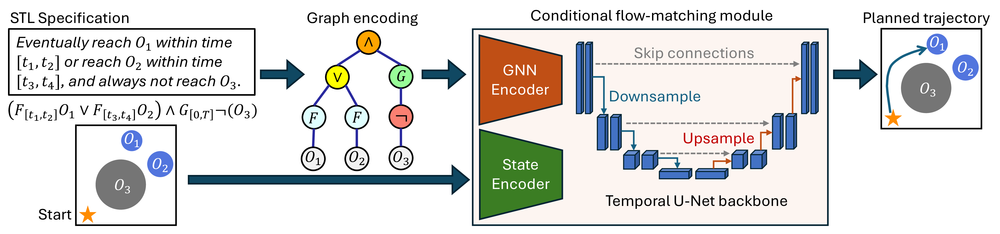
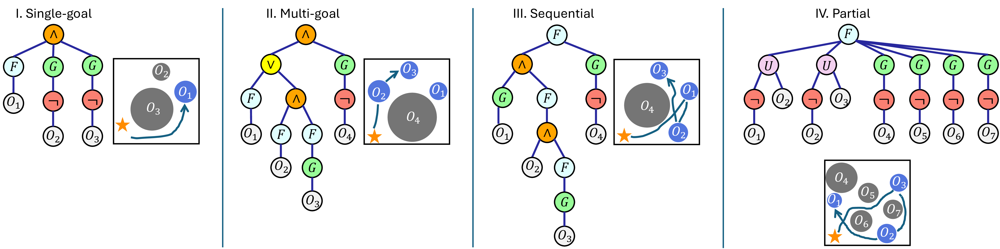
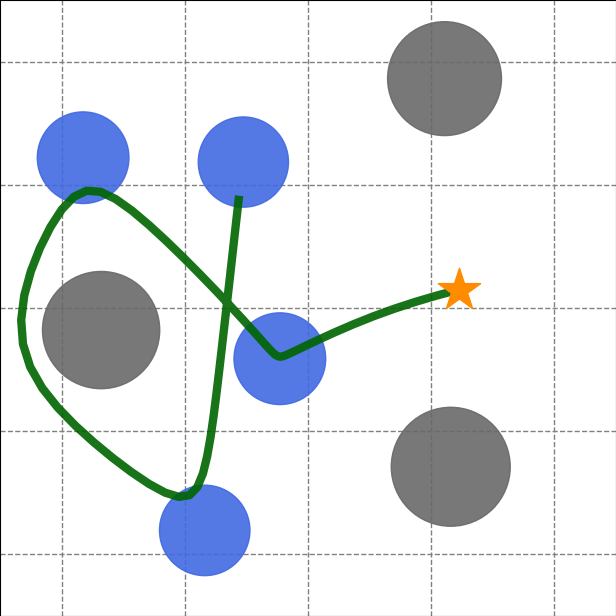
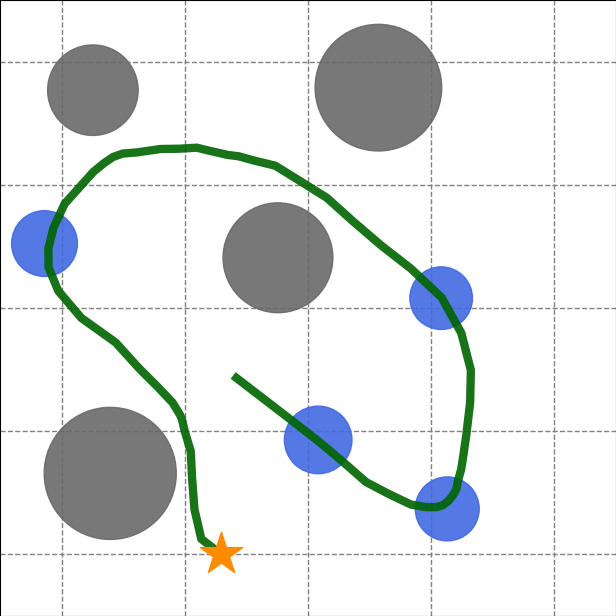
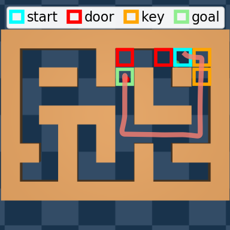
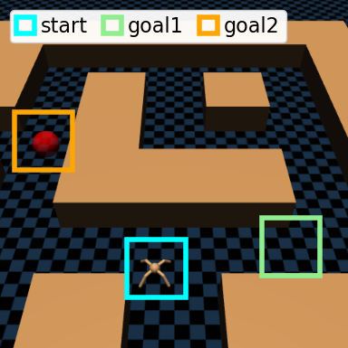
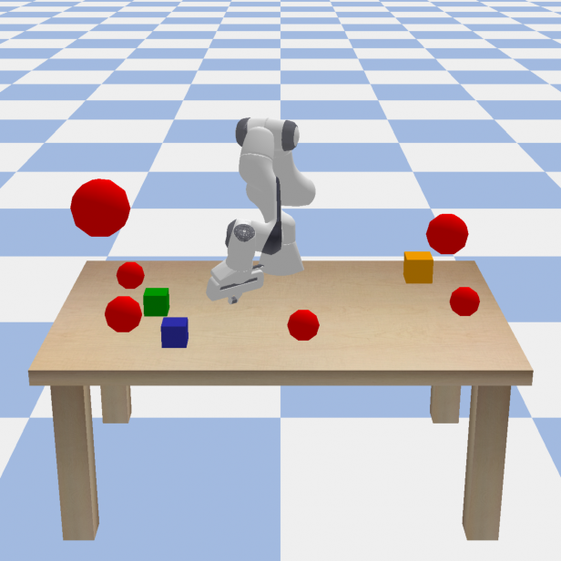
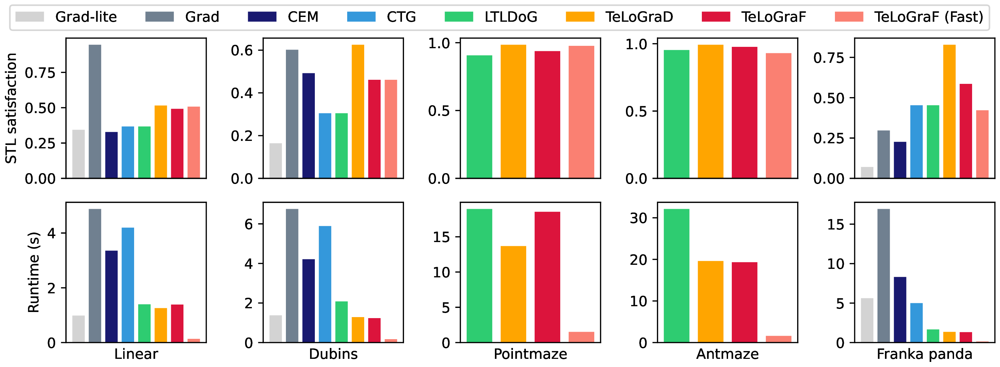

# TeLoGraF: Temporal Logic Planning via Graph-encoded Flow Matching

[](https://icml.cc/Conferences/2025/)
[](https://arxiv.org/abs/2504.03015)

[<ins>Reliable Autonomous Systems Lab @ MIT (REALM)</ins>](https://aeroastro.mit.edu/realm/)

[<ins>Yue Meng*</ins>](https://mengyuest.github.io/), [<ins>Chuchu Fan</ins>](https://chuchu.mit.edu/)


> A graph-based flow-matching framework that learns to solve general Signal Temporal Logic (STL) tasks across complex systems from a large dataset of specifications and demonstrations.


<p align="center"><em>Graph-encoding flow matching framework.</em></p>



<p align="center"><em>TeLoGraF can handle general STL specifications.</em></p>


<p align="center">
  <div style="display: inline-block; text-align: center; width: 18%; margin: 0 0.5%;">
    
    <div style="font-size: small;">Linear</div>
  </div>
  <div style="display: inline-block; text-align: center; width: 18%; margin: 0 0.5%;">
    
    <div style="font-size: small;">Nonlinear</div>
  </div>
  <div style="display: inline-block; text-align: center; width: 18%; margin: 0 0.5%;">
    
    <div style="font-size: small;">PointMaze</div>
  </div>
  <div style="display: inline-block; text-align: center; width: 18%; margin: 0 0.5%;">
    
    <div style="font-size: small;">AntMaze</div>
  </div>
  <div style="display: inline-block; text-align: center; width: 18%; margin: 0 0.5%;">
    
    <div style="font-size: small;">Panda</div>
  </div>
</p>

<p align="center"><em>TeLoGraF solves for a wide range of task environments.</em></p>


<p align="center"><em>Strong results in STL success rate and runtime efficiency.</em></p>

## Prerequisite
Code and dataset are coming soon.

## Usage
Code and dataset are coming soon.

## Reference
```bibtex
@inproceedings{meng2025audere,
  title={AuDeRe: Automated Strategy Decision and Realization in Robot Planning and Control via LLMs},
  author={Meng, Yue and Chen, Fei and Chen, Yongchao and Fan, Chuchu},
  journal={arXiv preprint},
  year={2025},
}
```